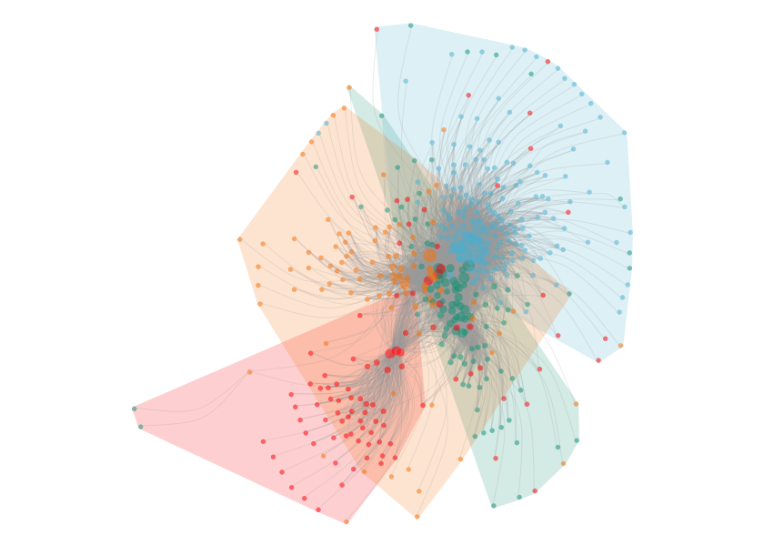

[](https://travis-ci.org/Wences91/altanalysis)

# Altmetric analysis

Stats and networks for altmetric mentions in R

## Installation

``` r
# Install from GitHub
# install.packages('devtools')
devtools::install_github('Wences91/altanalysis')
```

## Example

### Load data

``` r
altanalysis::socio_semantic_network(inf_co_an$edges,
                                    inf_co_an$keywords_mentions_cluster,
                                    layout=5,
                                    legend = inf_legend,
                                    nodes_size = c(2, 6),
                                    label_ratio = 0.001,
                                    custom_colors_nodes = c('#F98400', '#5BBCD6', '#00A08A', '#FF0000'),
                                    custom_colors_clouds = c('#00A08A', '#FF0000', '#5BBCD6', '#F98400'))
## Authors modularity (cloud): 0.32 | Clusters: 4
## Semantic modularity (nodes): 0.27 | Clusters: 4
```


